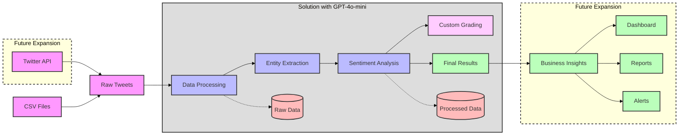

# Solution Architecture

```mermaid
%%{init: {'theme': 'base', 'themeVariables': { 'fontSize': '16px'}}}%%
flowchart LR
    %% Input Sources
    A1[Twitter API] --> A
    A2[CSV Files] --> A
    A[Raw Tweets] --> B[Data Processing]

    %% Expansion Opportunities
    subgraph Expansion1["Future Expansion"]
        A1
    end
    
    %% Main Processing Pipeline
    B --> C1[Entity Extraction]
    C1 --> C2[Sentiment Analysis]
    C2 --> C3[Custom Grading]
    
    %% Technical Components
    subgraph Solution["Solution with GPT-4o-mini"]
        B
        C1
        C2
        C3
        D
        D1
        D2
    end
    
    %% Data Storage
    B -.-> D1[(Raw Data)]
    C2 -.-> D2[(Processed Data)]
    
    %% Output
    C2 --> D[Final Results]
    D --> E[Business Insights]
    E --> E1[Dashboard]
    E --> E2[Reports]
    E --> E3[Alerts]
    
    %% Expansion Opportunities
    subgraph Expansion2["Future Expansion"]
        E
        E1
        E2
        E3
    end

    %% Styling
    classDef input fill:#f9f,stroke:#333,stroke-width:2px
    classDef process fill:#bbf,stroke:#333,stroke-width:2px
    classDef output fill:#bfb,stroke:#333,stroke-width:2px
    classDef storage fill:#fbb,stroke:#333,stroke-width:2px
    classDef solution fill:#ddd,stroke:#333,stroke-width:2px
    classDef expansion fill:#ffd,stroke:#333,stroke-width:2px,stroke-dasharray: 5 5
    classDef grader fill:#fcf,stroke:#333,stroke-width:2px
    
    class A,A1,A2 input
    class B,C1,C2 process
    class C3 grader
    class D,E,E1,E2,E3 output
    class D1,D2 storage
    class Solution solution
    class Expansion1,Expansion2 expansion
```